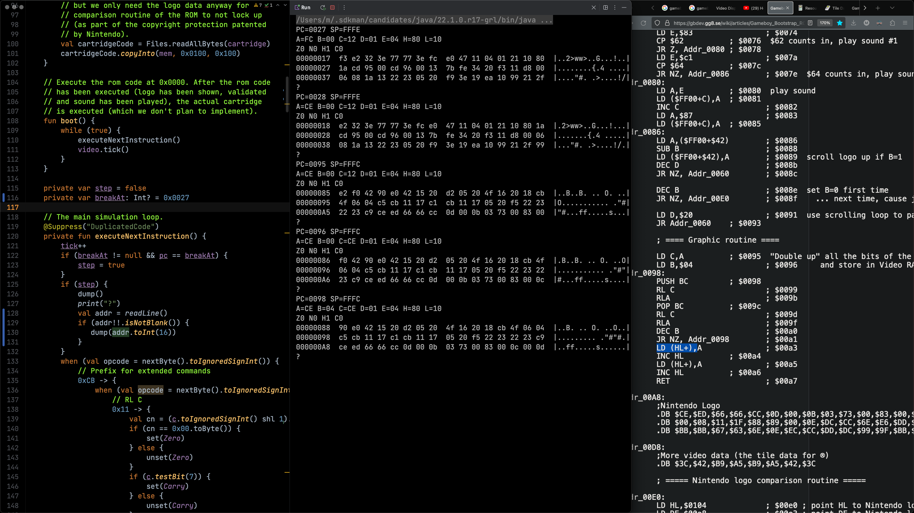
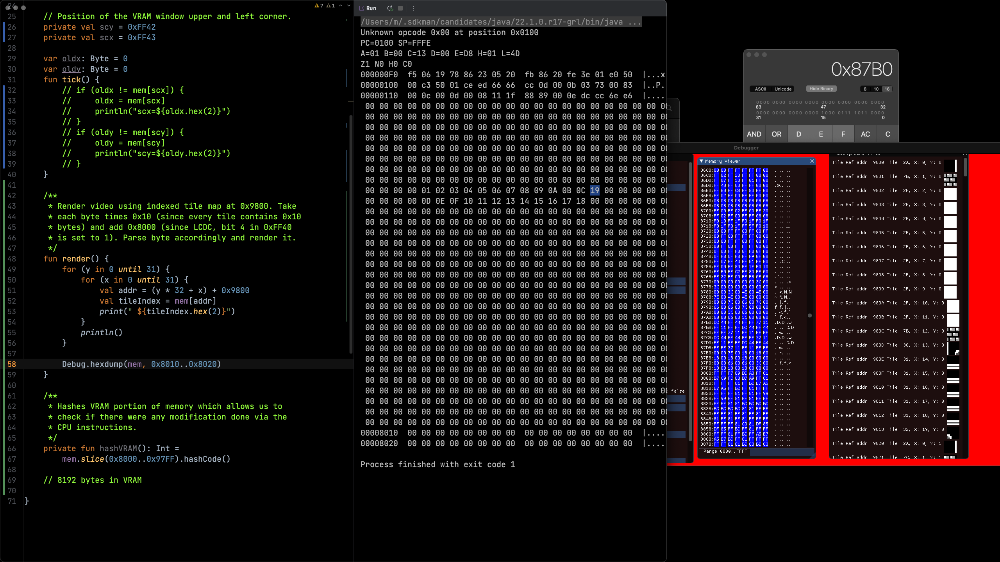

# Overview

## Goal
Show the Nintendo title animation when a Game Boy 
boots up [(reference video)](https://www.youtube.com/watch?v=g9x6alnYvIU&ab_channel=i12bretro) by simulating the boot process of a real Gameboy CPU and corresponding units, e.g. its PPU.

## Current status

I've reached the goal, i.e. this application is able to generate the single frames of the
animation, leading to this beautiful gif


To enable this, I've implemented

- [x] loading both boot and cartridge ROMS in Gameboy format
- [x] simulating the Gameboy classic CPU including all necessary registers, flags and instructions to **execute the original boot rom**.
- [x] handling video output by understanding and simulating the PPU (in a pragmatic way)

To keep this project small-ish, I've decided against adding a graphical library to show the results in realtime.
Instead, for every frame a single image is written (and stored in `frames/`). These frames can 
be concatenated to create a gif using ImageMagick.

Note that the interpreter intentionally fails after the boot rom has successfully
been interpreted and the animation has been played, i.e. stops at position 0x100 after generating the frames (which is expected).
```
Unknown opcode 0x00 at position 0x0100
PC=0100 SP=FFFE
A=01 B=00 C=13 D=00 E=D8 H=01 L=4D
Z1 N0 H0 C0
000000F0  f5 06 19 78 86 23 05 20  fb 86 20 fe 3e 01 e0 50  |...x.#. .. .>..P|
00000100  00 c3 50 01 ce ed 66 66  cc 0d 00 0b 03 73 00 83  |..P...ff.....s..|
00000110  00 0c 00 0d 00 08 11 1f  88 89 00 0e dc cc 6e e6  |..............n.|
```

## Build, Compile and Run

This is a standard gradle project, i.e. you can build it via `gradle build` and generate the frames via `gradle run`. Once the frame have been generated, the animation can be created via

```
# brew install imagemagick
convert -delay 1x30 -loop 0 frames/logo-*.ppm logo.gif
```

Note that you need to have the files `boot.gb` (a Game Boy boot rom) and `tetris.gb` (an arbitrary Game Boy cartridge format) in the `rom` directory. For obvious reasons, these are not provided here.

## Some fun facts

### Development process

Initially, I've abandoned the project before rendering the output because simulating the
video processor (handling scanlines, etc.) seemed to be a daunting task. After having some
new ideas I decided to take up the task again, leading to evenings where I spent my time 
looking at screens like the following:

Looking at the instructions of the boot rom and understanding what happens when a Game Boy boots up:


Looking at a running emulator to understand the memory layout of tile maps and video ram rendering:



### ROM logo parser
In `com.mlesniak.gameboy.CPU.showLogo`, I've implement a method to interpret the boot rom logo data and show the
parsed logo. 

```
00000000  31 fe ff af 21 ff 9f 32  cb 7c 20 fb 21 26 ff 0e  |1...!..2.| .!&..|
00000010  11 3e 80 32 e2 0c 3e f3  e2 32 3e 77 77 3e fc e0  |.>.2..>..2>ww>..|
00000020  47 11 04 01 21 10 80 1a  cd 95 00 cd 96 00 13 7b  |G...!..........{|
00000030  fe 34 20 f3 11 d8 00 06  08 1a 13 22 23 05 20 f9  |.4 ........"#. .|
00000040  3e 19 ea 10 99 21 2f 99  0e 0c 3d 28 08 32 0d 20  |>....!/...=(.2. |
00000050  f9 2e 0f 18 f3 67 3e 64  57 e0 42 3e 91 e0 40 04  |.....g>dW.B>..@.|
00000060  1e 02 0e 0c f0 44 fe 90  20 fa 0d 20 f7 1d 20 f2  |.....D.. .. .. .|
00000070  0e 13 24 7c 1e 83 fe 62  28 06 1e c1 fe 64 20 06  |..$|...b(....d .|
00000080  7b e2 0c 3e 87 e2 f0 42  90 e0 42 15 20 d2 05 20  |{..>...B..B. .. |
00000090  4f 16 20 18 cb 4f 06 04  c5 cb 11 17 c1 cb 11 17  |O. ..O..........|
000000A0  05 20 f5 22 23 22 23 c9  ce ed 66 66 cc 0d 00 0b  |. ."#"#...ff....|
000000B0  03 73 00 83 00 0c 00 0d  00 08 11 1f 88 89 00 0e  |.s..............|
000000C0  dc cc 6e e6 dd dd d9 99  bb bb 67 63 6e 0e ec cc  |..n.......gcn...|
000000D0  dd dc 99 9f bb b9 33 3e  3c 42 b9 a5 b9 a5 42 3c  |......3><B....B<|
000000E0  21 04 01 11 a8 00 1a 13  be 20 fe 23 7d fe 34 20  |!........ .#}.4 |
000000F0  f5 06 19 78 86 23 05 20  fb 86 20 fe 3e 01 e0 50  |...x.#. .. .>..P|
██   ██ ██                             ██       
███  ██ ██        ██                   ██       
███  ██          ████                  ██       
██ █ ██ ██ ██ ██  ██  ████  ██ ██   █████  ████ 
██ █ ██ ██ ███ ██ ██ ██  ██ ███ ██ ██  ██ ██  ██
██  ███ ██ ██  ██ ██ ██████ ██  ██ ██  ██ ██  ██
██  ███ ██ ██  ██ ██ ██     ██  ██ ██  ██ ██  ██
██   ██ ██ ██  ██ ██  █████ ██  ██  █████  ████ 

```